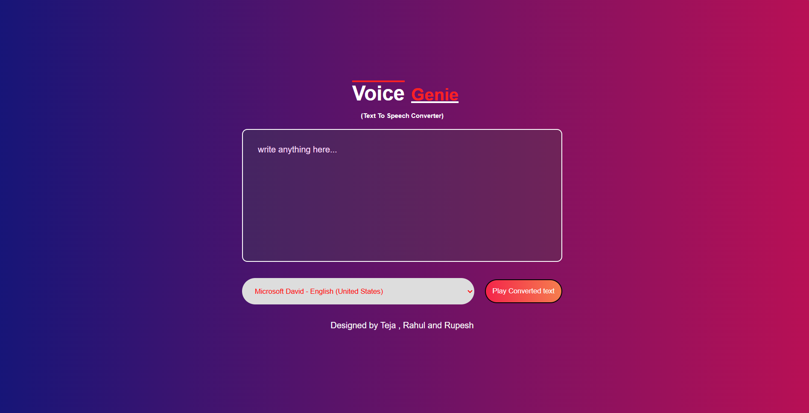

🎙️ Text To Speech Converter

A simple and responsive Text To Speech Converter built using HTML, CSS, and JavaScript.
This project converts written text into spoken audio using the browser's Speech Synthesis API.
---------------------------------------
## Screenshot

-----------------------------------
🚀 Features
- Convert text into speech instantly
- Simple and clean user interface
- Responsive design
- Multiple voice support (depends on browser)
- Easy to use
--------------------------
🛠️ Technologies Used
- HTML5
- CSS3
- JavaScript
---------------------------
📂 Project Structure
- text-to-speech/
- │
- ├── index.html
- ├── style.css
- ├── script.js
- └── README.md
------------------------
▶️ How to Run
- Download or clone the repository
- git clone https://github.com/rupesh1226/text-to-speech.git
- Open the project folder
- Run index.html in your browser

-----------------------
💡 How It Works
- User enters text into the textarea
- JavaScript uses the Speech Synthesis API
- Browser reads the text aloud
-------------------------------
🌐 Live Demo

Add your GitHub Pages link here.

https://rupesh1226.github.io/text-to-speech/
-------------------------------
📌 Future Improvements
- Add language selection
- Add speech speed control
- Add dark mode
- Download audio feature
- --------------
👨‍💻 Author

Rupesh
GitHub: https://github.com/rupesh1226
